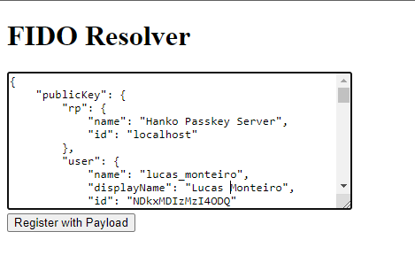
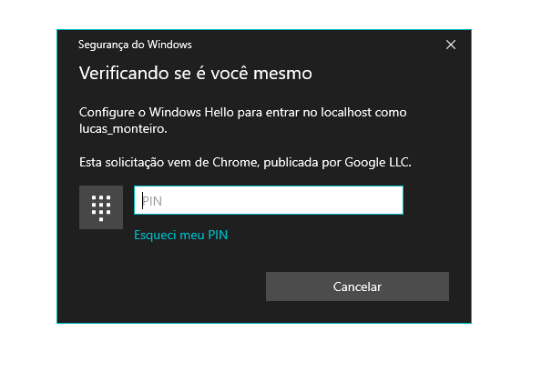
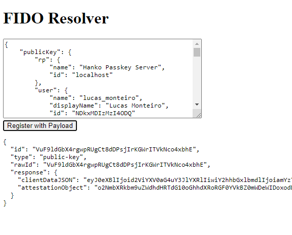

# Run

## Start https server
```
node index.mjs
```

## Paste payload after initialize on FIDO Server
https://localhost:8443


## Authenticate


## Copy response to send to finalize on FIDO Server
